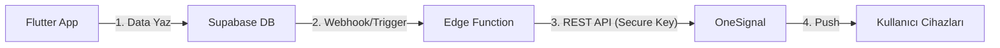

# Bildirim Sistemi Tasarımı (OneSignal + Supabase)

Bu doküman, OkulAsistan uygulamasında anlık ve zamanlanmış bildirimlerin (Push Notifications) yönetimi için OneSignal entegrasyon mimarisini tanımlar.

## 1. Mimari Genel Bakış

Bildirimler, güvenliği sağlamak amacıyla **İstemci (Flutter)** tarafından doğrudan gönderilmez. Bunun yerine, Flutter uygulaması Supabase veritabanına bir eylem kaydeder ve **Supabase Edge Functions** bu eylemi algılayarak OneSignal API üzerinden bildirimi tetikler.



## 2. Kullanıcı Etiketleme (Tagging) Stratejisi

OneSignal'da kullanıcıları doğru hedeflemek için "Data Tags" yapısı kullanılacaktır. Flutter tarafında kullanıcı giriş yaptığında bu etiketler güncellenir.

| Etiket Anahtarı | Değer Örneği | Amaç |
|---|---|---|
| `school_id` | `uuid-verisi` | Okul bazlı genel duyurular. |
| `role` | `teacher` / `admin` | Rol bazlı duyurular. |
| `user_id` | `auth-uid` | Kişiye özel bildirimler (Nöbet vb.). |
| `branch` | `Matematik` | Zümre bazlı bildirimler (Opsiyonel). |

---

## 3. Bildirim Türleri ve Senaryolar

### A. Nöbet Hatırlatma (Kişiye Özel)
*   **Senaryo:** Öğretmene nöbetinden 1 gün önce ve sabahında bildirim gitmeli.
*   **Yöntem:**
    *   **Zamanlanmış (Scheduled):** Nöbet planı oluşturulduğunda, Supabase Edge Function nöbet tarihine göre OneSignal'a "Scheduled Notification" isteği atar.
    *   **İçerik:** "Sayın Hocam, yarın 'Bahçe' bölgesinde nöbetçisiniz."

### B. Sınav Planı Bildirimi (Genel/Grup)
*   **Senaryo:** Sınav programı yayınlandığında tüm öğretmenlere bildirim gider.
*   **Hedef:** `school_id` filtresi.
*   **İçerik:** "1. Dönem 1. Yazılı Sınav programı yayınlandı."

### C. Yönetici Duyuruları
*   **Senaryo:** Okul müdürü acil bir duyuru yapar.
*   **Hedef:** Tüm okul (`school_id`) veya sadece öğretmenler (`role: teacher`).

---

## 4. Güvenli Tetikleme (Secure Triggering)

OneSignal **REST API Key** kesinlikle mobil uygulama içinde saklanmamalıdır. Bu anahtar sadece sunucu tarafında (Supabase Edge Function) bulunmalıdır.

### Edge Function Örneği (Typescript)

```typescript
// supabase/functions/send-notification/index.ts
serve(async (req) => {
  const { record } = await req.json(); // DB'den gelen veri
  
  // OneSignal API İsteği
  const response = await fetch("https://onesignal.com/api/v1/notifications", {
    method: "POST",
    headers: {
      "Authorization": `Basic ${Deno.env.get('ONESIGNAL_REST_KEY')}`,
      "Content-Type": "application/json",
    },
    body: JSON.stringify({
      app_id: Deno.env.get('ONESIGNAL_APP_ID'),
      include_external_user_ids: [record.teacher_id], // Hedef Kullanıcı
      contents: { en: record.message },
      headings: { en: record.title },
      // Zamanlama (Opsiyonel)
      send_after: record.scheduled_time 
    }),
  });
  
  return new Response("Bildirim gönderildi.");
});
```

---

## 5. Flutter Entegrasyonu

### Başlangıç Ayarları
`main.dart` içinde OneSignal başlatılır.

```dart
OneSignal.Debug.setLogLevel(OSLogLevel.verbose);
OneSignal.initialize("ONESIGNAL_APP_ID"); // App ID güvenli sayılır (public)
OneSignal.Notifications.requestPermission(true);
```

### Kullanıcı Girişi Sonrası
Kullanıcı ID'si ve etiketler OneSignal'a bildirilir.

```dart
Future<void> setupNotificationUser(User user) async {
  // External ID (Supabase Auth ID ile eşleştirme)
  await OneSignal.login(user.id);
  
  // Etiketlerin Gönülmesi
  await OneSignal.User.addTags({
    "school_id": user.userMetadata?['school_id'],
    "role": user.userMetadata?['role'],
  });
}
```

## 6. Veritabanı "Notifications" Tablosu

Bildirim geçmişini tutmak ve tetikleyici mekanızmayı çalıştırmak için `notifications` tablosu kullanılır.

| Alan | Tipi | Açıklama |
|---|---|---|
| `id` | uuid | PK |
| `target_user_id` | uuid | Kime? (NULL ise toplu) |
| `target_segment` | string | Hangi segmente? (Örn: 'Teachers') |
| `title` | text | Başlık |
| `message` | text | Mesaj |
| `send_at` | timestamp | Ne zaman gönderilecek? |
| `status` | text | 'pending', 'sent', 'failed' |

Supabase'de bir **Database Webhook** kurularak, bu tabloya `insert` yapıldığında Edge Function tetiklenir.
